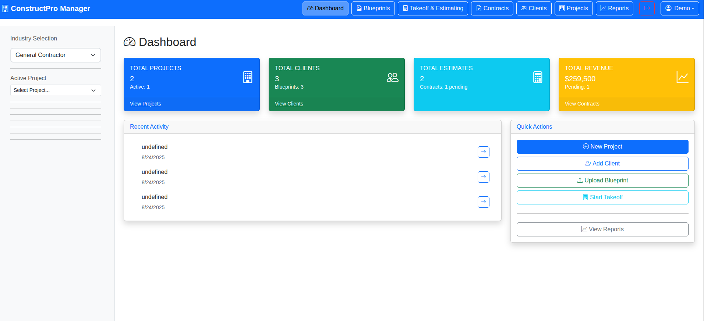

# ConstructPro Manager



A comprehensive construction management solution designed to streamline project workflows, client management, and financial tracking for construction professionals.

## 🚀 Features

### 📊 **Dashboard Overview**
- Real-time project statistics and metrics
- Revenue tracking and financial summaries
- Recent activity monitoring
- Quick action shortcuts

### 🏗️ **Project Management**
- Complete project lifecycle tracking
- Industry-specific templates (General Contractor, Electrical, Plumbing, HVAC, etc.)
- Project status monitoring and updates
- Timeline and milestone management

### 👥 **Client Management**
- Comprehensive client database
- Contact information and history
- Project associations and tracking
- Communication logs

### 📋 **Blueprints & Documentation**
- Blueprint upload and management
- Document organization and storage
- Version control and annotations
- Easy sharing and collaboration

### 🧮 **Takeoff & Estimating**
- Advanced material takeoff tools
- Cost estimation and pricing
- Labor and material calculations
- Customizable pricing templates

### 📄 **Contract Management**
- Contract creation and templates
- Digital signature integration
- Status tracking and renewals
- Payment milestone tracking

### 📈 **Reporting & Analytics**
- Financial performance reports
- Project profitability analysis
- Time tracking and productivity metrics
- Customizable report generation

## 🛠️ Technology Stack

- **Frontend**: HTML5, CSS3, JavaScript (ES6+)
- **UI Framework**: Bootstrap 5
- **Icons**: Bootstrap Icons
- **Backend**: Node.js/Express or Deno (dual runtime support)
- **Data Storage**: LocalStorage for demo, extensible to database
- **Architecture**: Modular component-based design

## 📦 Installation

### Prerequisites
- **Option 1**: Node.js (v14 or higher) and npm/yarn
- **Option 2**: Deno (v1.37 or higher)

### Local Development

#### Using Node.js (Traditional)

1. **Clone the repository:**
   ```bash
   git clone https://github.com/MSMITH71910/constructpro_manager.git
   cd constructpro_manager
   ```

2. **Install dependencies:**
   ```bash
   npm install
   ```

3. **Start the development server:**
   ```bash
   npm start
   ```

#### Using Deno (Modern Runtime)

1. **Clone the repository:**
   ```bash
   git clone https://github.com/MSMITH71910/constructpro_manager.git
   cd constructpro_manager
   ```

2. **Start with Deno (no installation needed):**
   ```bash
   deno task start
   # or for development with auto-reload:
   deno task dev
   ```

3. **Alternative npm scripts:**
   ```bash
   npm run deno:start
   npm run deno:dev
   ```

4. **Access the application:**
   Open your browser and navigate to `http://localhost:8000`

## 🔐 Authentication

The application includes a secure authentication system with user registration and login capabilities.

**Demo Credentials:**
- Username: `demo`
- Password: `demo123`

## 🏗️ Project Structure

```
constructpro_manager/
├── src/
│   ├── main.js                 # Main Electron process
│   ├── server.js              # Development server
│   └── renderer/              # Frontend application
│       ├── index.html         # Main HTML template
│       ├── app.js            # Main application logic
│       ├── styles/           # CSS stylesheets
│       └── modules/          # Modular components
│           ├── AuthManager.js      # Authentication handling
│           ├── DataManager.js      # Data management
│           ├── ProjectManager.js   # Project operations
│           ├── ClientManager.js    # Client operations
│           └── EstimateManager.js  # Estimation tools
├── package.json              # Project dependencies
└── README.md                # This file
```

## 🎨 User Interface

The application features a modern, responsive design with:
- **Intuitive Navigation**: Easy-to-use tabbed interface
- **Responsive Design**: Works seamlessly on desktop and mobile devices
- **Professional Styling**: Clean, construction-industry focused aesthetics
- **Accessibility**: WCAG compliant design principles

## 🔧 Configuration

### Environment Variables
Create a `.env` file in the root directory for custom configurations:

```env
PORT=8000
NODE_ENV=development
SESSION_SECRET=your_secret_key_here
```

### Industry Customization
The application supports multiple construction industry specializations:
- General Contracting
- Electrical Work
- Plumbing & Mechanical
- HVAC Systems
- Roofing & Exteriors
- Interior Finishing
- Landscaping & Earthwork

## 🚀 Deployment

See [DEPLOYMENT.md](DEPLOYMENT.md) for detailed deployment instructions including Vercel, Heroku, and other platforms.

## 📱 Browser Support

- Chrome (recommended)
- Firefox
- Safari
- Edge
- Mobile browsers (iOS Safari, Chrome Mobile)

## 🔒 Security Features

- Secure user authentication
- Session management
- Data encryption for sensitive information
- CSRF protection
- Input validation and sanitization

## 🤝 Contributing

1. Fork the repository
2. Create a feature branch (`git checkout -b feature/amazing-feature`)
3. Commit your changes (`git commit -m 'Add some amazing feature'`)
4. Push to the branch (`git push origin feature/amazing-feature`)
5. Open a Pull Request

## 📝 License

This project is proprietary software developed by Michael R Smith. All rights reserved.

## 👨‍💻 Author

**Michael R Smith**
- GitHub: [@MSMITH71910](https://github.com/MSMITH71910)
- Email: [contact information]

## 🙏 Acknowledgments

- Bootstrap team for the excellent UI framework
- Node.js community for the robust backend platform
- Construction industry professionals for workflow insights

## 📚 Documentation

For detailed documentation on specific features:
- [User Guide](docs/user-guide.md)
- [API Documentation](docs/api.md)
- [Development Guide](docs/development.md)

## 🐛 Bug Reports & Feature Requests

Please use the GitHub Issues page to report bugs or request new features.

## 📊 Roadmap

### Upcoming Features
- [ ] Mobile application (React Native)
- [ ] Advanced reporting dashboards
- [ ] Integration with accounting software
- [ ] Multi-user collaboration tools
- [ ] Cloud synchronization
- [ ] Advanced project scheduling (Gantt charts)
- [ ] Equipment and inventory management
- [ ] Time tracking and payroll integration

---

*ConstructPro Manager - Streamlining construction project management one build at a time.*