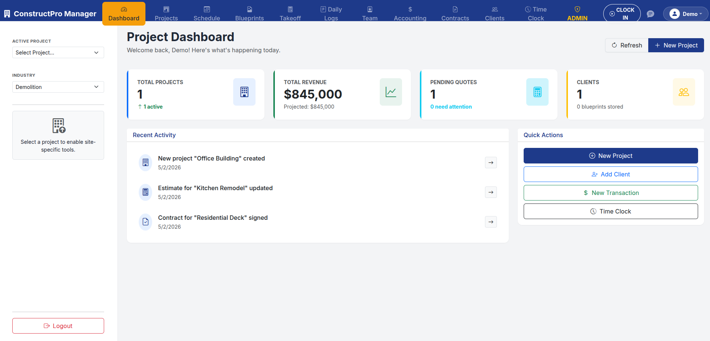
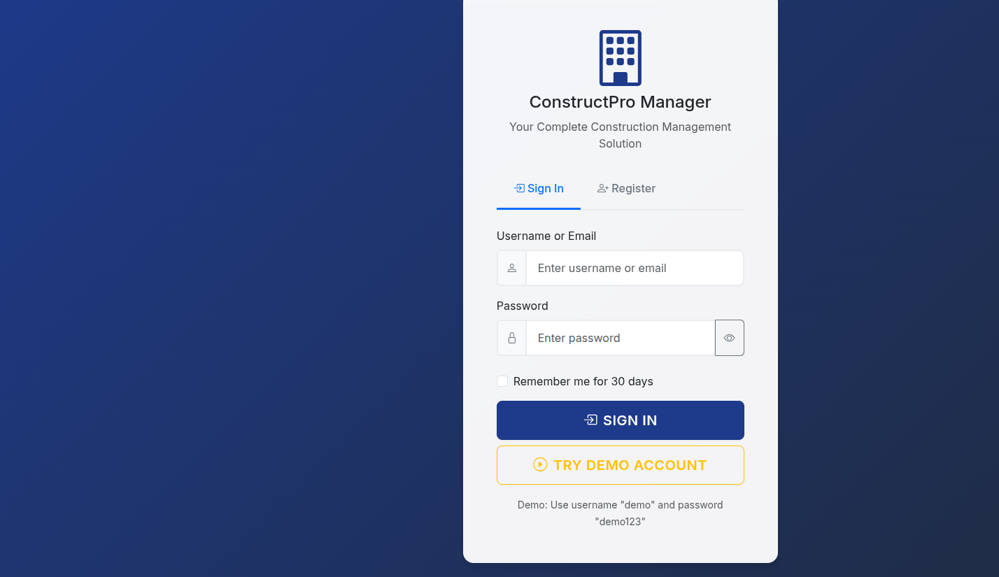

# ConstructPro Manager - Enterprise General Contractor Suite

<div align="center">
  
  <br>
  
</div>

**ConstructPro Manager** is a high-performance, all-in-one management suite I developed specifically for General Contractors and trade professionals. This platform transforms complex construction workflows into a streamlined, automated experience—handling everything from the first takeoff to final payroll.

I built this application to provide a professional-grade tool that contractors can actually use in the field to manage their businesses, crews, and finances with total precision.

---

## 🏗️ Core Enterprise Features

### 📊 **Integrated ERP & Financials**
- **Accounts Payable & Receivable**: Full tracking of project billing, vendor payments, and transaction history.
- **Payroll Ledger**: Automated staff payment management with support for Hourly, Salary, and Sub-Contractor wages.
- **Live Revenue Tracking**: Real-time financial health monitoring across all active projects.

### 👥 **Team Workspace & Collaboration**
- **Live Messenger**: Integrated real-time messaging system for instant communication between office and field.
- **Admin Control Center**: Advanced RBAC (Role-Based Access Control) to assign granular permissions (Project Manager, Estimator, Foreman, etc.).
- **Live Activity Feed**: ClickUp-style real-time updates on task completions and site inspections.

### ⏱️ **Field-Ready Time Clock**
- **Shift Management**: Project-specific clock-in/out system with real-time task selection.
- **Automated Timesheets**: High-visibility timers with automatic duration calculation and payroll integration.
- **Visual Status**: Navbar-integrated pulse indicators to track active shifts at a glance.

### 📐 **Precision Construction Tools**
- **Takeoff & Estimating**: Advanced measurement tools that flow directly into automated estimate generation.
- **Legal Contract Suite**: Generate professional, ready-to-sign contracts with PDF export and email integration.
- **Master Schedule**: Manage timelines with List, Board, and Gantt views for complex multi-site projects.
- **Blueprints & Daily Logs**: Centralized storage for site plans and automated daily reporting.

---

## 🛠️ Built for the Industry

I have optimized the platform for a wide range of specialties:
- **General Contracting** (Full administrative suite)
- **Demolition & Site Prep**
- **Chimney Sweep & Specialized Trades**
- **Electrical, Plumbing, & HVAC**
- **Interior & Exterior Finishing**

---

## 🚀 Tech Stack & Performance

I engineered this platform for speed and reliability using a modern modular architecture:
- **Core**: Vanilla JavaScript (ES6+), HTML5, CSS3
- **Styling**: Bootstrap 5 with custom Enterprise Dark/Light themes
- **Runtime**: Dual-support for **Node.js** and **Deno**
- **Deployment**: Optimized for Vercel and Electron-ready for desktop use
- **Data**: Robust local-first Data Management system with extensible JSON persistence

---

## 📦 Getting Started

### Prerequisites
- Node.js (v14+) or Deno (v1.37+)

### Installation
1. **Clone the repo:**
   ```bash
   git clone https://github.com/MSMITH71910/constructpro_manager.git
   cd constructpro_manager
   ```
2. **Setup:**
   ```bash
   npm install
   npm start
   ```

### 🔐 Demo Access
I have included a pre-configured admin account for demonstration purposes:
- **Login**: `demo`
- **Password**: `demo123`

---

## 👨‍💻 Developed By

**Michael R Smith**  
A dedicated solution for the construction industry, built by a professional who understands the field.

- **GitHub**: [@MSMITH71910](https://github.com/MSMITH71910)
- **Email**: [m.smith71910@gmail.com](mailto:m.smith71910@gmail.com)

---
*ConstructPro Manager - Built for Contractors, by a Contractor.*
